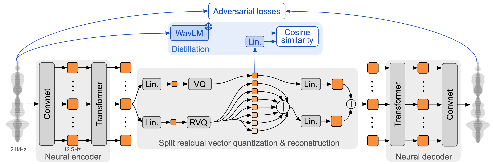
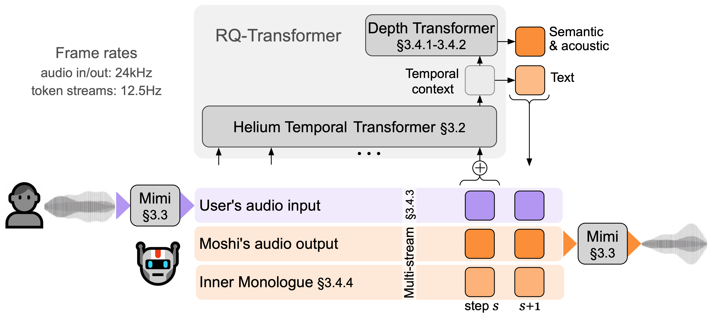

# Moshi & Mimi: Educational PyTorch Implementation

I was trying to study the official Kyutai Moshi repository and its corresponding paper, but found the codebase heavily optimized for production. It includes a massive Rust server, MLX inference paths, CUDA graphs, and complex streaming wrappers. I really just wanted to see the raw PyTorch math from the paper to understand how a state-of-the-art full-duplex spoken dialogue framework actually works under the hood.

So, I took a machete to it. I completely severed the Git history, stripped out all the deployment boilerplate, and rebuilt the core architecture from the ground up using pure, pedagogical PyTorch. 

This repository is essentially my structured notes and a barebones, "from scratch" PyTorch version of their architecture. It's meant for students, researchers, and tinkerers who want to understand the core mechanics without drowning in inference-optimization code. 

*(Disclaimer: Original weights, the Mimi codec design, and all credit goes to Kyutai Labs. This is simply an educational fork/exploration under the MIT license for study purposes.)*

---

## My Study & Implementation Journey

When breaking down a paper like Moshi, I find it best to start at the raw data (audio) and trace it all the way to the language model. Here is the flow I followed to unravel and implement the system.

### 1. The Mimi Codec: Squashing the Audio 
Located in `model/modules/seanet.py` and `model/models/mimi.py`.



The absolute first problem in processing speech is the sampling rate. The purpose of Mimi is to take raw $24\text{kHz}$ audio and compress it down so a Transformer can actually process it without memory blowing up. Predicting 24,000 samples per second autoregressively is computationally infeasible. To solve this, a 1D Convolutional Neural Network (SEANet) is used to downsample the sequence.

**The Math:**
The downsampling ratios inside the SEANet encoder are `8, 6, 5, 4, 2`.
If you multiply them out: $8 \times 6 \times 5 \times 4 \times 2 = 1920$.
$24000 \text{Hz} / 1920 = 12.5 \text{Hz}$.
So, 1 second of audio becomes exactly 12.5 "frames" in the latent space.

* **Input:** $X \in \mathbb{R}^{B \times 1 \times 24000}$
* **Output (after encoder):** $Z \in \mathbb{R}^{B \times 512 \times 12.5}$ (where 512 is the hidden dimension).

**The Role of SEANetResnetBlocks:**
While the `[8, 6, 5, 4, 2]` strided convolutions handle the data compression (reducing the sequence length), the actual feature extraction relies on stacked `SEANetResnetBlock`s nestled between each downsampling layer. These residual blocks vastly expand the receptive field, allowing each latent frame to "see" a wide context of the surrounding audio without altering the temporal resolution. This ensures high-frequency transients and complex acoustic features (pitch, timbre, formants) are preserved and that the deep convolutional network maintains strong gradient flow. In this pedagogical implementation, they are largely abstracted away as they primarily add computational cost and code volume without fundamentally changing the dimensional shape or flow of the tensor math through the sequence.

*Implementation Note:* Re-writing `seanet.py` was mostly about ensuring the 1D convolutions used the correct strides and causal paddings. They also put a small 2-layer Transformer right at the bottleneck (between the encoder and quantization) to gather better temporal context. 

---

### 2. Split-RVQ (Residual Vector Quantization): Semantics vs. Acoustics
Located in `model/quantization/split_rvq.py`.

Once we have our $12.5\text{Hz}$ latent representations, we need to discretize them into tokens for the Language Model.

This is probably the most fascinating part of the paper. Normal Residual Vector Quantization (RVQ) stacks codebooks to reduce reconstruction error. In doing so, the first codebook captures the "biggest" structural features, and the rest capture fine details.

Mimi forces the first codebook to be **Semantic** by distilling it from WavLM (a pretrained speech content model). This means the first token literally represents *what* is being said (like phonemes or text). The remaining 7 codebooks are **Acoustic** (capturing speaker voice, emotion, background noise, etc.).

So at each timestep $t$, we have 8 tokens: $q_0$ (semantic), and $q_1 \dots q_7$ (acoustic).

**The Straight-Through Estimator (STE) Trick:**
During implementation, I had to recall how to code the backward pass for `argmin` during quantization, since `argmin` is non-differentiable. The trick they use in pure PyTorch is pretty elegant:

```python
# x is continuous bottleneck, x_quant is the discrete codebook vector
x_out = x + (x_quant - x).detach()
```

In the forward pass, $x$ cancels out, and you just get $x_{quant}$. But in the backward pass, `detach()` kills the gradient for $(x_{quant} - x)$, so the gradient simply flows straight through $x_{out}$ directly into $x$.

---

### 3. The Moshi LM: Talking and Listening at the Same Time
Located in `model/models/lm.py`.



Writing the Moshi LM was a headache to decode at first. How does the model talk AND listen simultaneously? The answer is that it doesn't just do one sequence; it performs an "inner monologue". It employs a brilliant dual-stream architecture.

**The Components:**
1. **Helium (Temporal Transformer)**: A large autoregressive model that looks across time $T$.
2. **Depformer (Depthwise Transformer)**: A tiny autoregressive model that looks across the codebook layers $Q=8$ for a *single* time step.

At time $t$, Moshi has a text token $w_t$ and 8 audio tokens $a_{t,0} \dots a_{t,7}$. We embed all 9 of these and literally just sum them up into one vector:
$$H_t = emb_{text}(w_t) + \sum_{q=0}^7 emb_{audio, q}(a_{t,q})$$

**The Generation Step Explained:**
To implement the forward pass, the logic flows like this:
1. Pass the sequence $H_{0 \dots t}$ through the Temporal Transformer.
2. The output at time $t$ predicts the text token $w_{t+1}$. (This is the inner monologue where it thinks about *what* to say before saying it).
3. We take the temporal transformer state, flatten it, and feed it as the "start" token to the **Depformer**.
4. The Depformer predicts $a_{t+1, 0}$ (the semantic audio).
5. We feed $a_{t+1, 0}$ back into the Depformer to predict $a_{t+1, 1}$.
6. Repeat until we have all 8 audio tokens for frame $t+1$.

So $T$ progresses slowly, but inside every $T$, $Q$ progresses quickly. Translating this from their massive `lm.py` deployment file down to a clean 100-line PyTorch module made the routing suddenly "click" for me.

---

### 4. Training Distinctions & Loss Functions (Why our Notebooks differ from Reality)

When exploring the interactive mathematical walkthrough in `notebooks/01_mimi_codec_walkthrough.ipynb`, I implemented a simple `nn.MSELoss()` (Mean Squared Error) to prove that the raw `Conv1d` weights mathematically converge, allowing the Auto-Encoder to continuously trace dummy audio waves.

However, **this is drastically different from the paper's actual loss mechanism**. In a true production environment, relying solely on `MSELoss` causes generated audio to sound "muffled" and robotic. The real Mimi model resolves this by orchestrating a massive composite loss function, balancing four separate mathematical penalties via scalar weights ($\lambda$):

$$L_{total} = \lambda_{stft} L_{stft} + \lambda_{adv} L_{adv} + \lambda_{fm} L_{fm} + \lambda_{quant} L_{quant}$$

1. **$L_{stft}$ — Multi-Scale STFT Loss (Frequency Domain):** 
   Instead of comparing raw amplitude squiggles mathematically, this converts raw waves into Mel-Spectrograms (heat maps of frequency). By calculating L1/L2 distances across multiple window sizes, it ensures the output sounds correct even if there are invisible, microscopic phase shifts that would otherwise ruin a simple MSE calculation.
2. **$L_{adv}$ — Adversarial (GAN) Loss:** 
   Mimi uses secondary "enemy" networks called Discriminators (Multi-Period and Multi-Scale). Their only job is to analyze the audio and classify whether it is "Real" or "Fake". The Mimi Decoder gets penalized if it fails to trick the discriminator. This mathematically forces the decoder to synthesize hyper-realistic human textures like breaths, plosives, and vocal fry, rather than just averaging the sound.
3. **$L_{fm}$ — Feature Matching Loss:** 
   A perceptual style metric. It pulls the internal hidden activation layers out of the Discriminator and calculates the distance between the real audio's deep features and the generated audio's features. This ensures the output physically structuralizes speech properly at a deep-network level.
4. **$L_{quant}$ — Quantization Commitment Loss:**
   Because Mimi uses a discrete codebook, there is a penalty applied tightly onto the Encoder to prevent its continuous outputs from wandering. It forces the encoded latent vectors to stay completely tethered to their closest discrete integer targets inside the codebook before the Straight-Through-Estimation step. 

---

## Where Everything Is

* `model/` -> The actual PyTorch math stripped of the deployment wrappers (SEANet, Split-RVQ, Moshi LM).
* `scripts/mock_train.py` -> A simple script I wrote to prove the gradients actually flow through the LM -> Depformer -> Audio Heads without crashing.
* `notebooks/` -> Scratchpad area for testing out the codec shapes and playing with the logic.

---

## References

* **Moshi:** A Speech-Text Foundation Model for Real-Time Dialogue. *Kyutai Labs*. [ArXiv](https://arxiv.org/abs/2410.00034)
* **Original Repository:** [kyutai-labs/moshi](https://github.com/kyutai-labs/moshi)
* **WavLM:** Large-Scale Self-Supervised Pre-Training for Full Stack Speech Processing (Used for Mimi's semantic distillation). [ArXiv](https://arxiv.org/abs/2110.13900)

---

## License

This educational fork is open-sourced under the **MIT License**. 

Please note that the original Moshi architecture, concept, paper, and pre-trained weights remain the property of **Kyutai Labs**. If you choose to utilize their official weights in tandem with this barebones implementation, please adhere to their licensing constraints and terms.
